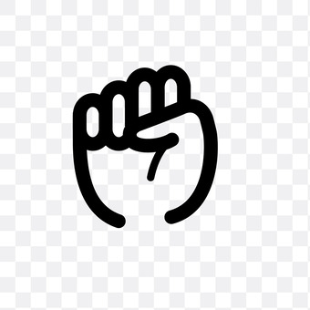

##  Rock Paper Scissors Game

A simple browser-based **Rock Paper Scissors** game where the user competes against the computer. The game keeps track of scores and displays messages based on who wins each round.

###  Live Demo
Open `index1.html` in your browser to play the game.

---

###  Project Structure

```
rock-paper-scissors/
├── index1.html       # Main HTML file
├── style.css         # Styles for layout and design
├── first1.js         # JavaScript logic for gameplay
├── rock.jpeg         # Rock image
├── paper.jpeg        # Paper image
├── scissor.jpeg      # Scissors image
```

---

###  How to Run the Game

1. **Download or clone** the project folder to your computer.
2. Make sure all files (including images) are in the same folder.
3. **Double-click `index1.html`** or open it using any browser (e.g., Chrome, Firefox).

 Make sure image paths are **relative**, not absolute. In `index1.html`, change:
```html

```
to:
```html

```

---

###  Technologies Used

- HTML
- CSS
- JavaScript 

---

###  Features

- User vs Computer gameplay
- Score tracking for both players
- Dynamic game messages (win, lose, draw)
- Visual feedback on hover


